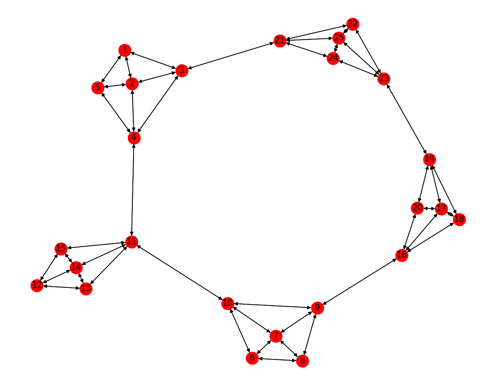
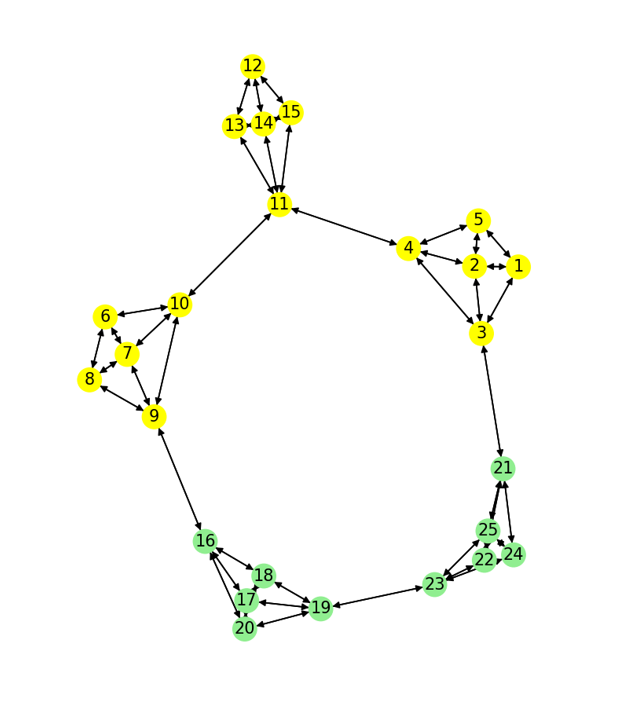
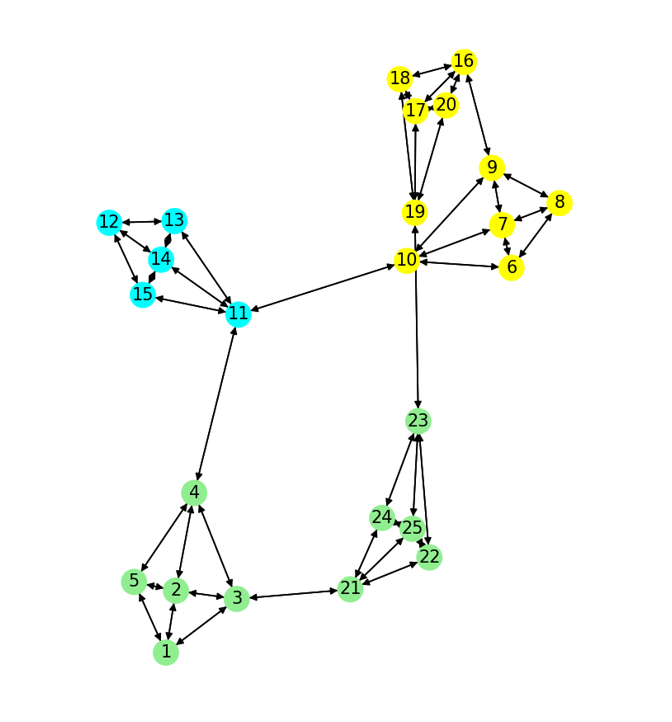
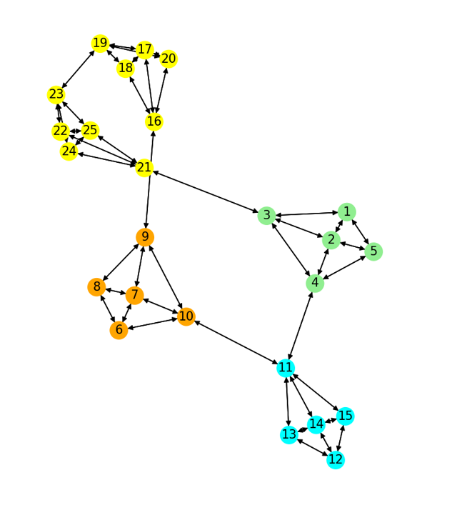
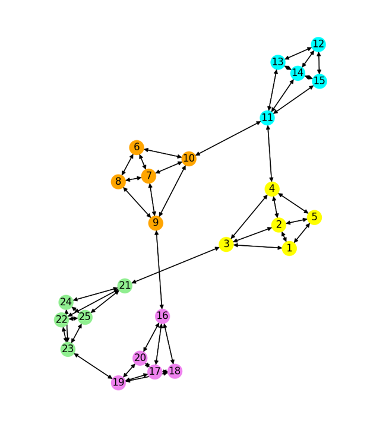
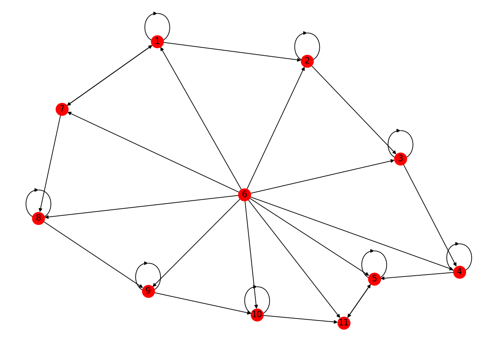

# 
🔥  PracticeLinear_Lab5  🔥

## 
♦️  *Задание 1*  ♦️

#### 🌟 Исходный граф
`Graph = nx.DiGraph() ` : Создайте ориентированный граф
 

##### ☀ `Draw(2, colors)  # Для k = 2`

##### ☀ `Draw(3, colors)  # Для k = 3`

##### ☀ `Draw(4, colors)  # Для k = 4`

##### ☀ `Draw(5, colors)  # Для k = 5`

## 
♦️  *Задание 2*  ♦️

#### 🌟 Исходный граф

🔳 Алгоритм PageRank
  - Алгоритм PageRank — это алгоритм обучения ранжированию, основанный на анализе графа ссылок между веб-сайтами, каждый веб-сайт будет рассматриваться как вершина, каждая ссылка будет рассматриваться как ребро графа.
  - Предположим, у нас есть набор из n веб-страниц с номерами от 1 до N, PageRank веб-страницы i рассчитывается на основе других веб-страниц, ссылающихся на нее (веб-сайт j ссылается на i), но не каждая ссылка получает одинаковую оценку, нам нужен честный алгоритм! Алгоритм PageRank построен на основе двух основных идей:
      1. Сайт A ссылается на B. Если сайт A имеет высокий рейтинг на доске, то он должен помочь B занять более высокий рейтинг.
      2. Веб-сайт A ссылается на B, количество веб-сайтов, на которые указывает A, обратно пропорционально рейтингу B, другими словами, чем больше страниц, на которые указывает A, тем меньше это помогает B повысить свой рейтинг.
  
  - Алгоритм PageRank использует матрицу M, которая представляет собой матрицу переходов между веб-страницами. Эта матрица показывает вероятность перехода с одной страницы на другую. Каждый элемент матрицы M[i][j] = $\frac{m}{n}$, если страница j ссылается на страницу i,
    - где:
         + n - общее число стрелочек, выходящих из j-й вершины.
         + m - число стрелочек, выходящих из j-й вершины и входящих в i-ю вершину.
    - M[i][j] = 0 в противном случае.
  
  - Таким образом, матрица M отражает структуру ссылок между веб-страницами. Если страница j имеет ссылку на страницу i, то элемент M[i][j] будет ненулевым, что указывает на возможность перехода с j на i. Если страница j не имеет ссылки на страницу i, то элемент M[i][j] будет = 0, что означает отсутствие прямого перехода.

🔳 Формула алгоритма PageRank выглядит следующим образом: p = M.p
  -   Где: p - собственный вектор M соответствует наибольшему собственному значению 1.
    
🔳 Почему важен именно этот собственный вектор, а не какой-то другой? 
  - Используя этот собственный вектор, алгоритм PageRank может определить количество ссылок на веб-сайт и качество этих ссылок. Сайты высокого качества, имеющие много ссылок с других важных сайтов, сами по себе будут иметь большую ценность.
  - Таким образом, использование собственного вектора, соответствующего наибольшему собственному значению в алгоритме PageRank, помогает идентифицировать наиболее важные веб-сайты в веб-сети и играет важную роль в ранжировании веб-сайтов по важности.

🔳 Какую роль играет параметр d
  - В алгоритме PageRank параметр d (также известный как коэффициент демпфирования) играет роль в определении важности перехода с одного веб-сайта на другой по ссылке.
  - Параметр d имеет значение от 0 до 1 и обычно в алгоритме PageRank устанавливается равным 0,85.
  - Параметр d помогает регулировать распределение мощности между узлами сети. Если d = 1, каждая страница будет иметь одинаковый уровень важности и влияние ссылок не будет. Напротив, если d = 0, учитываются только некоторые из наиболее важных сайтов, а другие сайты не имеют никакой ценности.

🔳 Какое отношение всё это имеет к марковским процессам?

  🔺 Если мы внимательно проанализируем алгоритм PageRank, то будет 2 ответа, на которые мы должны ответить:
  - Во-первых: действительно ли M имеет собственное значение 1 ?
  - Во-вторых: предположим, что если M имеет собственное значение 1, попадает ли p в какой-то особый случай, когда результат не имеет для нас смысла? Собственное значение может иметь множество собственных векторов. Является ли p единственным решением, которое мы можем найти ?
  
  🔺Отношение к марковским процессам
  - В алгоритме PageRank каждая веб-страница рассматривается как состояние марковского процесса. Связи между сайтами создают матрицу перехода состояний Маркова, где каждый элемент (i, j) матрицы представляет вероятность перехода с сайта i на сайт j.
  - Марковский процесс обладает марковскими свойствами, то есть вероятность перехода состояний зависит только от текущего состояния и не зависит от прошлого. В случае алгоритма PageRank вероятность перехода состояния с одной веб-страницы на другую зависит только от марковской матрицы перехода состояний и параметра d (коэффициента затухания).
  - Марковский процесс в алгоритме PageRank используется для расчета рейтинга веб-страниц на основе вероятности перехода по ссылкам. Путем итеративного обхода веб-страницы и обновления вероятностей перехода состояний алгоритм PageRank находит стабильное распределение вероятностей, в пределах которого определяется значение PageRank каждой веб-страницы.
  - Таким образом, марковский процесс является важной концепцией алгоритма PageRank, который помогает моделировать и рассчитывать рейтинги веб-страниц на основе вероятностей перехода состояний.

🟥 Алгоритм PageRank после редактирования.
- Если есть ссылка от j до i: $p_{i}$ = $\frac{1-d}{N}$ + $\frac{d}{n_{j}}$, где:
  - N - Общее количество вершин в графе.
  - $n_{j}$ - Общее число стрелочек, выходящих из j-й вершины.
- Иначе: $p_{i}$ = $\frac{1-d}{N}$ 
